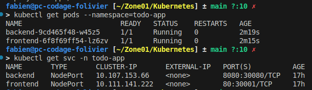

# 📝 Application ToDo

Une application web simple de gestion de tâches, développée avec **React** en frontend et **Go** en backend avec une base de données en **SQLite**.

## Fonctionnalités principales
- Afficher la liste des tâches
- Ajouter une tâche
- Marquer une tâche comme terminée
- Supprimer une tâche


## Utilisation de Kubernetes via minikube (local)
**Installation de kubectl**
```sh
curl -LO https://dl.k8s.io/release/$(curl -Ls https://dl.k8s.io/release/stable.txt)/bin/linux/amd64/kubectl
chmod +x ./kubectl
sudo mv ./kubectl /usr/local/bin/kubectl
kubectl version --client
```

**Installation de Minikube (pour un environnement local)**
```sh
curl -Lo minikube https://storage.googleapis.com/minikube/releases/latest/minikube-linux-amd64 && chmod +x minikube
sudo mkdir -p /usr/local/bin/
sudo install minikube /usr/local/bin/
```

**Mise en service**
```sh
minikube start

# Création des images Docker
eval $(minikube -p minikube docker-env)
docker build --build-arg GO_MINIKUBE_IP=$(minikube ip) -t server_todo ./backend
docker build --build-arg REACT_APP_API_URL=http://$(minikube ip):30080 -t front_todo ./frontend

# Deploiement des images dans un espace dédié
kubectl create namespace todo-app
kubectl apply -f backend-pvc.yaml -f backend-deployment.yaml -f frontend-deployment.yaml --namespace=todo-app
```

**Vérification**
```sh
kubectl get pods --namespace=todo-app
kubectl get svc -n todo-app
```
Voici un exemple de retour si tous fonctionne correctement :</br>


**Accès à l'application**
```sh
# Accèder au back
http://<MINIKUBE IP>:30080/todos
# Accèder au front
http://<MINIKUBE IP>:30001
```

**Nettoyage**
Quand vous n'avez plus besoin de l'application, voici les commandes pour nettoyer et supprimer les éléments de l'espace dédié
```sh
kubectl delete all --all -n todo-app
docker image rm front_todo server_todo
minikube stop
```

## Auteur
- OLIVIER Fabien
